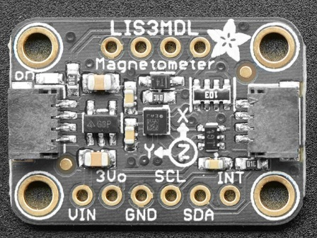

# Raspberry Pi LIS3MDL Example

This repository contains a short example script that tests out the LIS3MDL digital output magnetic sensor using my own Raspberry Pi [I2C library](https://github.com/besp9510/pi_i2c). This test includes setting up the device and reading magnetic field data.



This example requires the following dependencies (projects authored by me):
* [pi_lw_gpio.c](https://github.com/besp9510/pi_lw_gpio)
    * "Lightweight GPIO Interface Library for the Raspberry Pi"
* [pi_microsleep_hard.c](https://github.com/besp9510/pi_microsleep_hard)
    * "Hard Microsleep Library Via System Timer for the Raspberry Pi"
* [pi_i2c.c](https://github.com/besp9510/pi_i2c)
    * "Inter-Integrated Circuit (I2C) Library for the Raspberry Pi"

## Getting Started

These instructions will get you a copy of the project up and running on your local machine for development and testing purposes.

### Installing

#### Obtain the Project

First, clone this repository.

```
$ git clone https://github.com/besp9510/pi_lis3mdl_example.git
```

Alternatively, download the repository from Git.

#### Make

Compile test_lis3mdl.c into an executable.

```
$ make
```

## Running the Test

test_lis3mdl.c is a test script to check and see the I2C library working on your Pi with a LIS3MDL device. The outline of the test is:
1. Configure I2C library
2. Scan for the device
3. Verify device I.D.
4. Configure device
    * Set performance mode and sensitivity
5. Select operating mode
6. Get measurement status
7. Read magnetic field data in a loop
